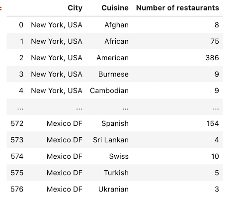
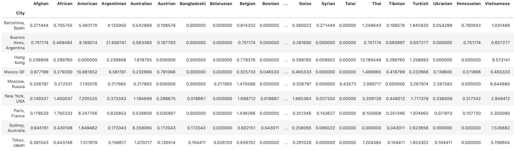
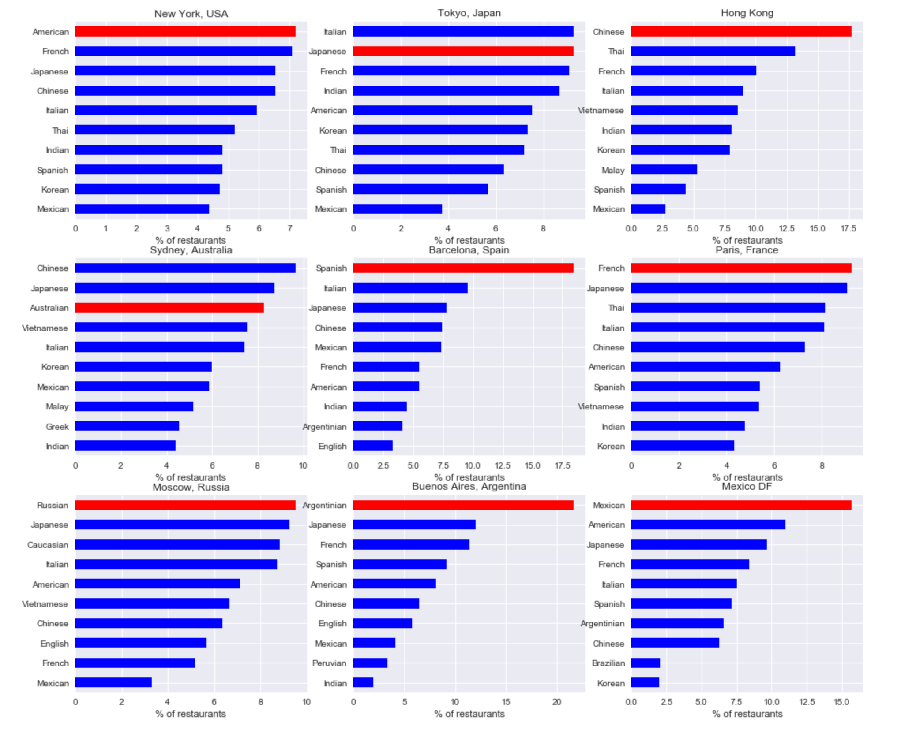
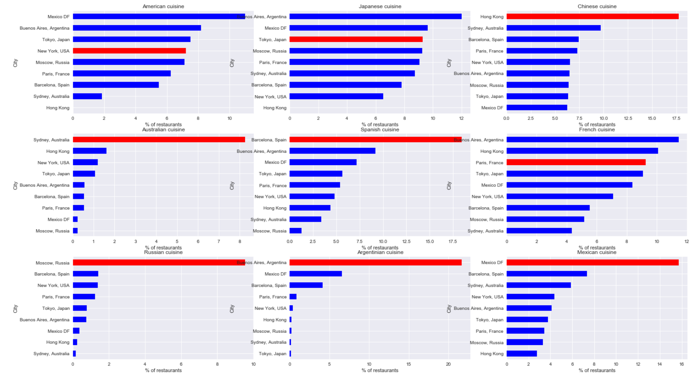
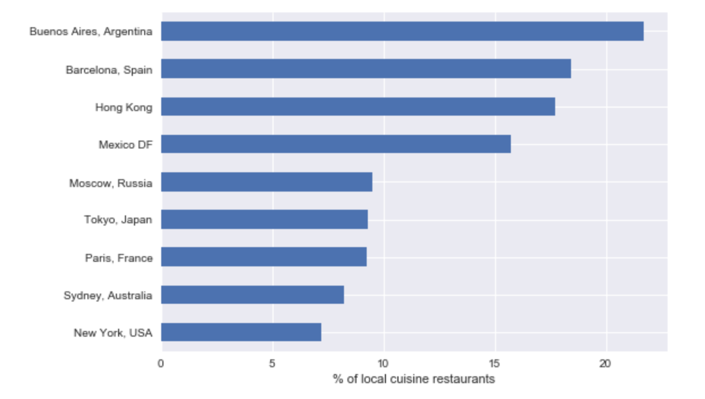
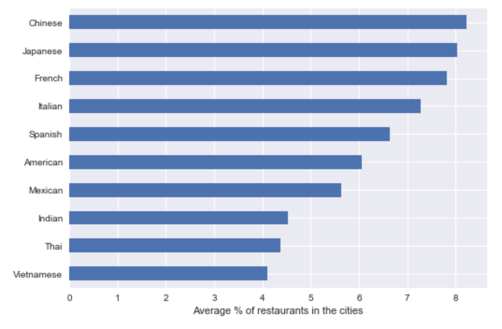

# Best Cuisines in Town
By *Guillermo Barreiro*

## Introduction
There are plenty of well-know cuisines around the world, like the Chinese, Japanese, Mexican, Spanish... It might be obvious that the best place to taste Mexican food is Mexico, and so on, but it might be very tedious to visit so many countries to taste each different cuisine. With this solution, foodies will be able of trying the best dishes of international cuisine without having to visit every single country. Moreover, this project will give people interested in migration movements an insight into how people from some nationalities move to specific cities and open restaurants where they prepare the food from their countries.

In this project, the cities of New York, Tokyo, Hong Kong, Sydney, Barcelona, Paris, Moscow, Buenos Aires and Mexico DF will be explored, in order to find which are the top cuisines on each city, and which city is the best to try each cuisine. The information extracted in this project can be really interesting for gourmets and traveling-lovers, inspiring them for their next trip.

## Data
For this project, the [Foursquare API](https://developer.foursquare.com) will be used. As a user, you need a Developer Account, in order to get the credentials for authenticating your HTTP requests. For each city mentioned above, we'll ask the API for the restaurants of each kind of international cuisine, one by one, and store the results in a Pandas DataFrame, in order to process it later and perform some interesting analytics.

Some information needs to be extracted before start using the API, like the `categoryId` for each kind of cuisine, or the local cuisine for each of the explored cities. For the first, the complete list of venue categories is available in (https://developer.foursquare.com/docs/build-with-foursquare/categories/). From here, we'll manually extract the categories under `food` corresponding to national cuisines (Spanish, Indian, Thai...), in order to be able of filtering the restaurants only by the nationality, and not other unrelevant criteria, like vegan, halal, burger place...

For each city mentioned above, we'll ask the API for the restaurants of each cuisine: `https://api.foursquare.com/v2/venues/explore?&near={city}&categoryId={category_id}`). For each city and cuisine, the number of restaurants (`['response']['totalResults']`) will be saved in a DataFrame.

## Methdology

In first place, the [Explore endpoint documentation](https://developer.foursquare.com/docs/venues/explore) was read, in order to understand what kind of data we had to work with, and how we could get the information of interest. As mentioned above, the parameters sent to this method are the city in `near` and the cuisine in `categoryId`. For testing the API, [Postman](https://postman.com) HTTP client was used.

Then, in the notebook, three data structures were manually defined: the list of cities to be explored, the `categoryId` for each kind of international cuisine and the local cuisine for each explored city.

The next step was getting from the API the number of restaurants of each cuisine for each city, and store it in a DataFrame. This was done through a double *for loop*, making an HTTP request on each iteration to `https://api.foursquare.com/v2/venues/explore?&near={city}&categoryId={category_id}`, with the corresponding city and cuisine, and storing the `['response']['totalResults']` object in the DataFrame.

After having all the data downloaded, the DataFrame had to be transformed, in order to be ready for getting the information of interest. Through a one-hot encoding of the cuisines and a gropuing by city, a new DataFrame was created, where each row was a city, and each column the number of restaurants of each cuisine. Finally, the rows were normalized, so each column represented the percentage of restaurants of each cuisine for each city. This was done because depending on the size, lifestyle and other factors, in some cities there might be a higher number of restaurants than in others.

*DataFrame before processing:*

*DataFrame after processing:*

With the data ready to work with, four insights were presented:
- **The top 10 cuisines for each city**
- **The top cities for each cuisine**
- **Popularity of local cuisine on each city**
- **Most popular cuisines in the world**

For this four insights, the result was presented with a horizontal bar graph, plotted with Matplotlib. For the first two, the bar corresponding to the local cuisine or city where that cuisine is local, respectively, was shown in a different color.

## Results

Before showing the results, it's important to make an observation. In this project, we're working with 65 different types of cuisines, those available in Foursquare corresponding to a country. Since the results shown here are in percentages (over 100), **in an equitative division, a 1.54% would correspond to each cuisine**
. I think this is an important clarification, since without it, it might seem that a percentage of 20% for some cuisine in some city might not be too much, when actually it would be a really high percentage.

The first analysis, the **top 10 cuisines for each city**, showed that in most of the cities, the local cuisine was the winner. However, in some like Barcelona or Buenos Aires, the difference between the local cuisine and the 2nd most popular was a lot bigger than in others like Paris or New York. In some cities we can see how the most popular cuisines are from close countries: for instance, in Mexico DF, American restaurants are quite popular; in Hong Kong, Thai and Vietnamese food seems also to be very popular, or in Sydney, food coming from East Asian countries like China, Japan, Vietnam or Korea is very famous. However, it's not the case of New York, where the difference between the 1st and 10th more popular is less than a 3%, or Barcelona, where after Spanish food and Italian, the following three most popular cuisines are Japanese, Chinese and Mexican, countries which are very far from Western Europe.

Looking at the results above, it looks like local cuisine is not always the favorite. The question that arises now is the opposite than before, which are the **top cities for each cuisine**. Since there are tons of cuisines, in this notebook the experiment was only done with those cuisines which were local in the cities analyzed here.

- Chinese, Australian, Spanish, Russian, Argentinan and Mexican cuisines are quite more popular in their respective cities than in the rest of the world. The difference was especially high with Australian and Russian.
- American, Japanese and French cuisines are more popular in some foreign cities, like Mexico DF or Buenos Aires, rather than in their countries' capital cities. 

As we saw before, in some cities the local cuisine is not the most popular. By analyzing the **popularity of local cuisine on each city**, it can be stated that Argentinan food in Buenos Aires, Spanish in Barcelona, Chinese in Hong Kong and Mexican in Mexico DF are more popular than local cuisines in the other explored cities.

Does this mean that Spanish, Argentinan, Chinese and Mexican cuisines are the most beloved and popular in the world? It doesn't look like it. According to the fourth and last insight, the **most popular cuisines in the world** are the Chinese, Japanese, French, Italian and Spanish. We saw that Chinese food in Hong Kong or Spanish food in Barcelona were extremely popular, while in Paris or Tokyo the local cuisines were quite close in popularity to foreign ones. 

Is it a coincidence? Well, looking back to the previous insight, local cuisines were not as popular in Tokyo or Paris as in Hong Kong or Barcelona. This explains the results got from the fourth insight, since these cuisines are very popular all around the world, but without that meaning that in their countries they are worshipped.

## Future recommendations

The results fetched from this project are very interesting, especially for those interested in traveling and gastronomy. However, for doing a deeper research, more cities should be explored. It would be very interesting to add some Italian city like Rome, Firenze or Napoli to the list, as well as Istanbul, Bangkok and Hánoi, since Italian, Turkish, Thai and Vietnamese cuisines are very popular, and this way it would be possible to check if they're popular in their respective cities too.

For the top cuisines, which according to the results of this project were Chinese, Japanese, French, Italian and Spanish, it would be a good idea to include more cities for each country. For instance, in Spain, Barcelona represents a 11% of the country population, so adding cities like Madrid, Valencia, Bilbao, Sevilla or Santiago de Compostela wouldn't give only a better sample of the country, but also include different varieties of the Spanish cuisine, like the Catalan, Basque or Galician ones.

Another recommendation would be to take into account the ratings of the restaurants, since here all the results come from the number of venues, but not their quality. The Foursquare API offers access to the ratings of the venues, even though this would make the API querying loop a lot slower.

## Conclusion

In this project, data from the Foursquare API was used to perform an analysis of cuisines popularity along the world. With bar graphs, the results were presented in an attractive and easy to understand way, allowing us to better understand which are the most popular cuisines and how popular they're in their respective countries. This project showcases at the same time how useful a geographical data API like Foursquare can be to carry studies about very diverse topics, and also how powerful are the Python-based open-source tools used here, like JupyterLab, Pandas, Matplotlib...